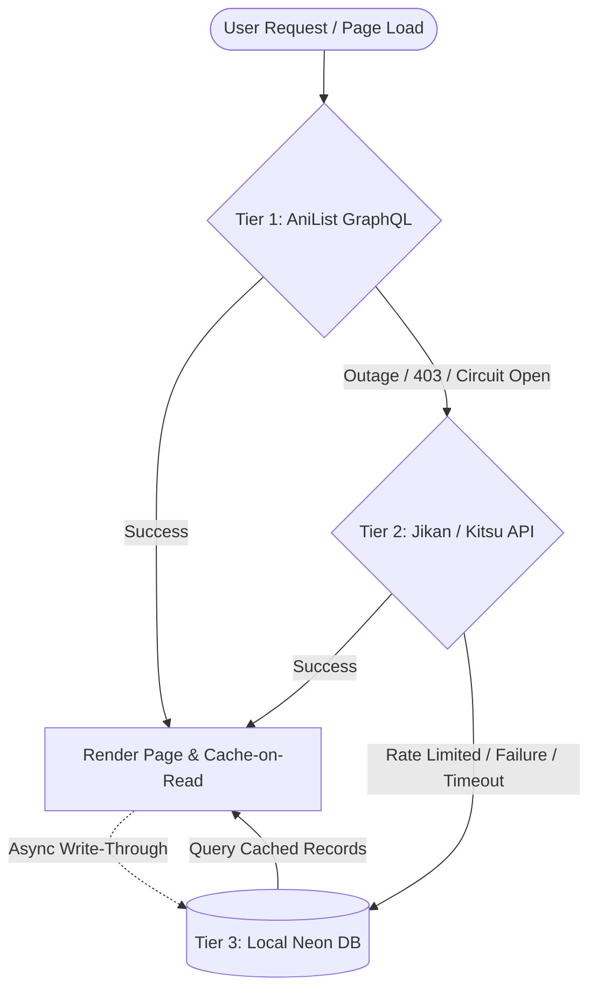

# Technical Design: Tier 3 Database-Backed Anime Metadata Cache & Failover

## 1. Problem Statement & Motivation
Currently, Wave Anime relies primarily on the AniList GraphQL API to populate all catalog cards, search results, schedules, and anime details dynamically on the client. 
While a secondary fallback layer to Jikan/Kitsu was recently introduced, both remain third-party dependencies vulnerable to:
1. Extended upstream outages (e.g. AniList experienced a 12-hour global blackout).
2. Strict third-party rate limits and response throttling.
3. Unpredictable network latency.

Wave Anime already maintains a synchronized PostgreSQL database (Neon DB) containing show IDs and sub/dub counts from Anikoto (`anime_episodes`), as well as denormalized titles and image URLs for `watch_history`.
By capturing and caching complete anime metadata in a local `anime_metadata` table, Wave Anime establishes a **Tier 3 self-hosted ground truth** that provides 100% uptime for catalog, search, and detail pages even during total third-party outages.

---

## 2. 3-Tier Failover Architecture



- **Tier 1 (Primary)**: AniList GraphQL API — Fast, rich client-side metadata and schedules.
- **Tier 2 (Secondary Fallback)**: Jikan v4 & Kitsu API — Public proxy fallback with SFW safety guards.
- **Tier 3 (Local Ground Truth)**: Neon Database (`anime_metadata`) — Completely resilient, zero external API latency, never blocked by upstream outages.

---

## 3. Database Schema

### Table: `anime_metadata`
Stored in `db/schema.ts` (Next.js app) and `backend/src/db/schema.ts` (Render backend):

```ts
export const animeMetadata = pgTable("anime_metadata", {
  mal_id: integer("mal_id").primaryKey(),
  ani_id: integer("ani_id"),
  title_english: text("title_english"),
  title_romaji: text("title_romaji"),
  cover_image_large: text("cover_image_large"),
  cover_image_extra_large: text("cover_image_extra_large"),
  cover_color: text("cover_color"),
  banner_image: text("banner_image"),
  description: text("description"),
  genres: text("genres").array(),
  episodes: integer("episodes"),
  format: text("format"),                   // "TV", "MOVIE", "OVA", etc.
  status: text("status"),                   // "RELEASING", "FINISHED", etc.
  average_score: integer("average_score"),
  season_year: integer("season_year"),
  is_adult: boolean("is_adult").default(false).notNull(),
  updated_at: timestamp("updated_at").defaultNow().notNull(),
}, (table) => [
  index("anime_meta_ani_id_idx").on(table.ani_id),
  index("anime_meta_status_score_idx").on(table.status, table.average_score),
  index("anime_meta_updated_idx").on(table.updated_at),
]);
```

### Safety & Integrity Constraints:
- **Universal Adult Filter**: Enforces `is_adult = false` and filters out `"Hentai"`/`"Erotica"` genres before inserting any row.
- **Drizzle Upsert Batching**: Adheres to the workspace guideline: uses `sql`excluded.column_name`` in `onConflictDoUpdate` for all batch operations.

---

## 4. Backend Seeding & Enrichment (`backend/`)

### Script: `backend/src/scripts/seedMetadata.ts`
1. **Catalog Scan**: Extracts all integer MAL IDs from `anime_episodes` where no entry currently exists in `anime_metadata`.
2. **AniList Multi-ID Batching**:
   - Queries up to 50 IDs per GraphQL request:
     ```graphql
     query($ids: [Int]) {
       Page(page: 1, perPage: 50) {
         media(idMal_in: $ids, type: ANIME, isAdult: false, genre_not_in: ["Hentai"]) {
           id
           idMal
           title { english romaji }
           coverImage { large extraLarge color }
           bannerImage
           description
           genres
           episodes
           format
           status
           averageScore
           seasonYear
           isAdult
         }
       }
     }
     ```
   - 1,000 anime records require only ~20 HTTP requests.
3. **Rate Limit Throttle**: 2.5-second pause between 50-item batches to stay well below AniList's 90 requests/minute ceiling.
4. **Jikan Fallback per Batch**: If an ID is missing from AniList, attempts Jikan fallback `/anime/{id}` before skipping.
5. **Database Upsert**: Batch inserts mapped records using Drizzle ORM.

---

## 5. Ongoing Ingestion Pipeline

1. **Scheduled Anikoto Sync**: In `backend/src/cron/sync.ts`, whenever new anime IDs are inserted into `anime_episodes`, the cron job checks `anime_metadata` and enriches missing IDs during the same background run.
2. **Frontend Write-Through (Next.js `/api/anime/cache-metadata`)**: When users successfully view or browse an anime on the frontend that wasn't already in Neon DB, an asynchronous non-blocking POST updates `anime_metadata`.
3. **Upstash Redis Compatibility**: The schema maps 1:1 with `AniListAnime`. An Upstash Redis caching wrapper can be dropped in front of Neon DB queries in the future without changing frontend consumers.

---

## 6. Frontend Failover Integration (`lib/api/anilist.ts`)

A dedicated fallback endpoint `/api/anime/db-fallback` is exposed by Next.js:
- Supports `action: "details"`, `action: "popular"`, `action: "trending"`, and `action: "search"`.
- Converts `anime_metadata` rows back into standard `AniListAnime` objects.
- In `lib/api/anilist.ts`, every method wraps its operations:
  ```ts
  try {
    // 1. AniList
  } catch {
    try {
      // 2. Jikan / Kitsu
    } catch {
      // 3. Neon DB Fallback
      return fetchDbFallback(...);
    }
  }
  ```

---

## 7. Verification & Testing Plan
1. **Schema Migration**: Run `pnpm exec drizzle-kit generate` and verify schema definitions compile without error.
2. **Seeding Script Validation**: Execute `seedMetadata.ts` with a small batch (e.g. 10 items) and verify records are populated in Neon DB with adult content excluded.
3. **Outage Simulation**: Intentionally trigger the circuit breaker in `lib/api/anilist.ts` and disable external fetches to confirm that Home, Search, and Anime Details seamlessly load data from Neon DB.
4. **Browser Verification**: Check page rendering, cover images, and episode counts when serving from database cache.
